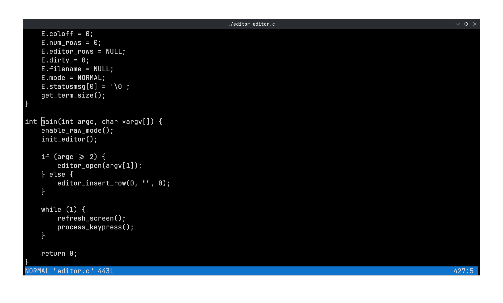

# RefEd - Refolding Editor

Minimal terminal-based text editor written in less than 500 lines of C



## Features

- two modes:
    - `NORMAL` for navigation and commands
    - `INSERT` for text input
- opening and saving files
- handles scrolling files larger than screen both vertically and horizontally
- status bar

## Usage

```bash
cc editor.c -o editor && ./editor <file>
```

If no file is provided, a new empty buffer is created

### Keybindings

After opening file press `h`, `j`, `k` and `l` to move, `i` to enter `INSERT` mode, `esc` to exit. type `w` to save and `q` to quit. `PgUp` and `PgDN` both work, as well as arrow keys in both modes

## TODO

- Minor bugs
- Sytax highlighting
- Search text
- Undo / Redo system
- Tabs and indentation
- Status messages and prompts
- Line numbers
- UTF-8 / Unicode
- More keybindings
- Copy / Paste support
- Optimize for large lines / files
